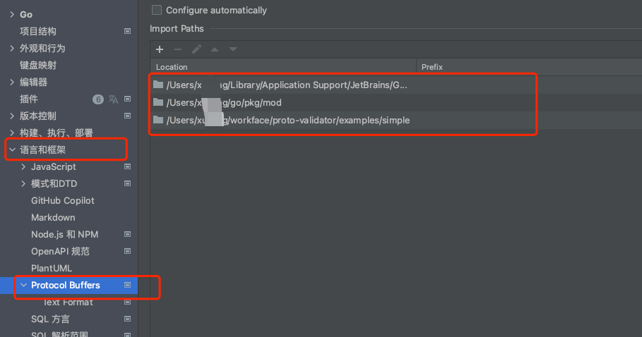

### proto-validator
proto-validator是我们在平时开发中为了解决业务痛点而创造的。  为了实现proto dto的定义和参数验证
，原来我们只能在写业务代码时自己再去做参数验证，会造成一定量的重复劳动。而proto-validator可以实现
在定义proto时就可以声明参数验证规则，通过proto-gen-av生成自动验证代码，把参数验证自动处理掉。

与github上其它类似的库的区别？
我人为最大的区别是更节省了一步。 我看了其它库主要是生成validate规则，然后需要用户在业务代码中调一下
这个验证方法，自行返回错误。 我是一步重复劳动都不想做，所以把验证并返回报错这一步也自动化了。

### protoc-gen-av  
全称 protoc-gen-auto-validator 简称protoc-gen-av

### 最佳实践
先安装protoc-gen-av插件

go install github.com/Gitforxuyang/proto-validaotr/cmd/protoc-gen-av

#### 简单服务(单个服务)
[参考examples/simple](examples/simple)

#### 多个服务(对于有些大仓库，很多服务在同一个目录下)
[参考examples/multi](examples/multi)

### QA

#### 为什么需要复制plugin.proto文件到自己的服务里
因为go mod模式下，无法通过原来gopath的方式去src目录下读取第三方库的文件了。 所以只能这样

#### 为什么还需要传创建error的方法
因为有些业务有自己的error对象，无法直接返回系统的error，所以提供创建error对象的方法，供使用方自己
去定义error的创建

#### 我的proto文件在goland里标红怎么办
在goland中配置对proto文件的读取目录，如下图所示：
