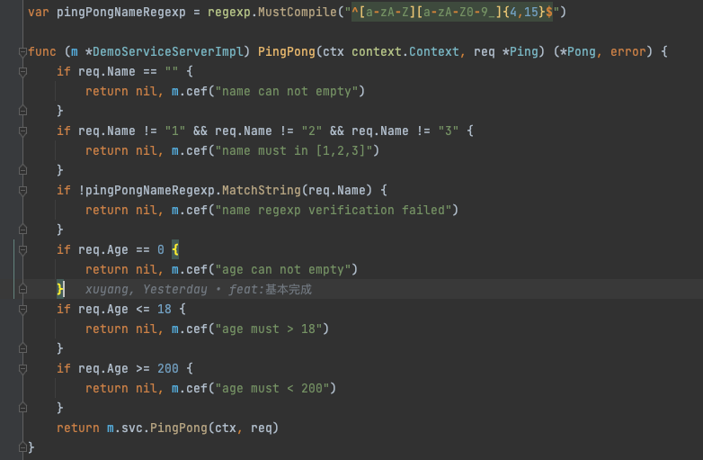

### proto-validator

proto-validator是我们在平时开发中为了解决业务痛点而创造的。 为了实现proto dto的定义和参数验证 ，原来我们只能在写业务代码时自己再去做参数验证，会造成一定量的重复劳动。而proto-validator可以实现
在定义proto时就可以声明参数验证规则，通过proto-gen-av生成自动验证代码，把参数验证自动处理掉。

与github上其它类似的库的区别？ 我人为最大的区别是更节省了一步。 我看了其它库主要是生成validate规则，然后需要用户在业务代码中调一下 这个验证方法，自行返回错误。
我是一步重复劳动都不想做，所以把验证并返回报错这一步也自动化了。

### protoc-gen-av

全称 protoc-gen-auto-validator 简称protoc-gen-av

### 最佳实践

先安装protoc-gen-av插件

go install github.com/Gitforxuyang/proto-validaotr/cmd/protoc-gen-av@v1.0.2

#### proto定义即可自动完成参数验证

定义：

编译的自动参数验证代码：

#### 简单服务(单个服务)

[参考examples/simple](examples/simple)

#### 多个服务(对于有些大仓库，很多服务在同一个目录下)

[参考examples/multi](examples/multi)

#### 方法介绍

所有的默认值等于不启用插件 比如如果设置gte=0，可能本意是需要入参>=0，但是插件无法读取，所以请不要在配置中使用 各类型的零值

| 字段类型 | 默认值 | 类型 |当字段是string类型时 |repeated时|int32/int64/uint32/uint64时|float/double时|message类型时|
|  :----:|  :----: | :----: |:----: |:----: |:----: |:----: |:----: |
| omitempty | true | bool |不能为空字符串|数组长度不能为0|值不能为0|值不能为0|不能为nil|
|gte|0|double|不支持|长度必须>=n|值必须>=|值必须>=|不支持|
|gt|0|double|不支持|长度必须>n|值必须>|值必须>|不支持|
|lte|0|double|不支持|长度必须<=n|值必须<=|值必须<=|不支持|
|lt|0|double|不支持|长度必须<n|值必须<|值必须<|不支持|
|eq|""|string|字符串=n|长度必须=n|值必须=n|值必须=n|不支持|
|in|""|string|格式必须是[1,2,3]|不支持|格式必须是[1,2,3]|格式必须是[1.1,2.2,3.3]|不支持|
|regexp|""|string|正则表达式|不支持|不支持|不支持|不支持|

### QA

#### 为什么需要复制plugin.proto文件到自己的服务里

因为go mod模式下，无法通过原来gopath的方式去src目录下读取第三方库的文件了。 所以只能这样

#### 为什么还需要传创建error的方法

因为有些业务有自己的error对象，无法直接返回系统的error，所以提供创建error对象的方法，供使用方自己 去定义error的创建

#### 我的proto文件在goland里标红怎么办

在goland中配置对proto文件的读取目录，如下图所示：

### TODO

如果有需要，可以增加一个自定义错误信息的字段

### 其它
新上线的仓库，欢迎使用，如果发现什么问题，欢迎提issue，实时维护。